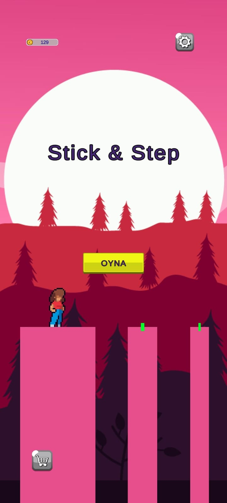
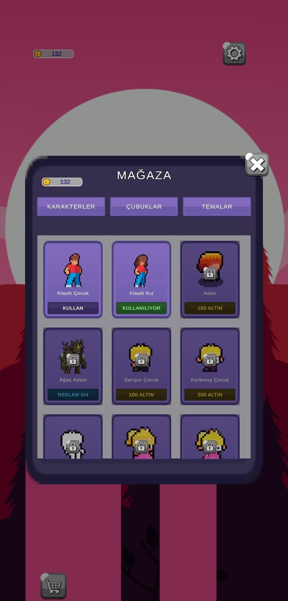
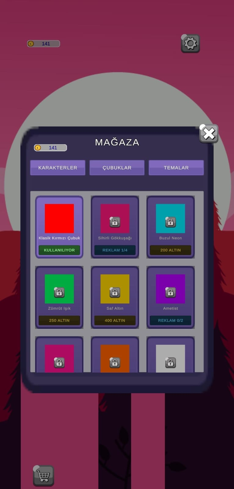
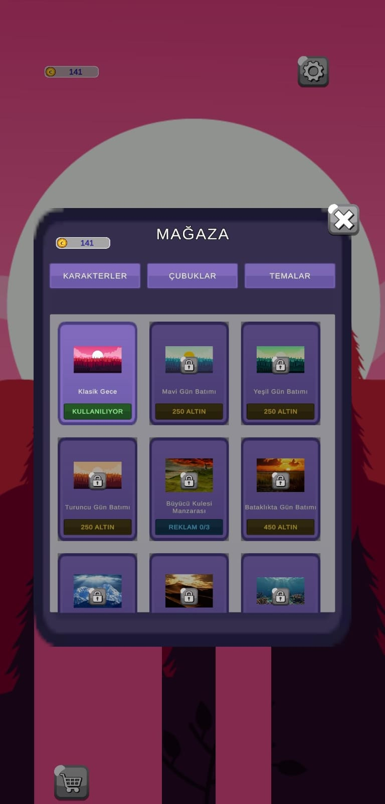

https://github.com/user-attachments/assets/8228ce92-1081-4c8f-b370-24e3d48b98cb

# 🕹️ Stick & Step - 2D Precision Mobile Platformer

<p align="center">
  <video src="https://github.com/user-attachments/assets/8228ce92-1081-4c8f-b370-24e3d48b98cb" width="340" controls autoplay loop muted></video>
</p>

<p align="center">
  
  
  
  
  
</p>

<p align="center">
  <b><a href="#-english">English</a></b> | <b><a href="#-türkçe">Türkçe</a></b>
</p>

---

## 🌐 English

### 📌 Overview
**Stick & Step** is a hyper-casual 2D precision timing mobile platformer where players build bridges of dynamic lengths by holding and releasing the screen to traverse procedurally spaced pillars.

This repository serves as an **Engineering Showcase & Architectural Case Study**, keeping commercial binary assets (licensed artwork, SDK plugins, release keystores) private while displaying **core gameplay algorithms**, **procedural locomotion physics**, **event-driven shop architecture**, and the **Google Play Target SDK 36 (Android 15) custom build pipeline**.

---

### 📸 Gameplay & Interface Architecture

<p align="center">
  
  
  
  
</p>

---

### 🧠 Engineering Highlights & Code Breakdown

#### 1. Dynamic Bridge Growth & Quadratic Fall Physics (`StickController.cs`)
Bridge extension operates proportionally to input duration. Instead of basic linear rotation, the fall simulation is driven by a quadratic curve ($t^2$) using `Quaternion.Slerp` to mimic realistic gravitational acceleration. Landing checks verify bounding box coordinates:

```csharp
private IEnumerator FallRoutine()
{
    Quaternion startRotation = transform.rotation;
    Quaternion targetRotation = Quaternion.Euler(0f, 0f, -90f);

    float elapsed = 0f;
    while (elapsed < fallDuration)
    {
        elapsed += Time.deltaTime;
        float t = elapsed / fallDuration;
        transform.rotation = Quaternion.Slerp(startRotation, targetRotation, t * t); // Gravity acceleration simulation
        yield return null;
    }

    transform.rotation = targetRotation;
    currentState = StickState.Walking;
    EvaluateFall();
}
```

#### 2. Procedural Locomotion Mathematics (`PlayerController.cs`)
Character movement eliminates traditional animator overhead by calculating tilt and bounce through procedural trigonometric equations:
* **Tilt:** `Mathf.Sin(walkTimer) * tiltAngle` produces responsive angular sway.
* **Bounce:** `Mathf.Abs(Mathf.Cos(walkTimer)) * bounceHeight` creates vertical step bounce.
* **Coroutine Safety Failsafe:** Integrated `timeout` ensures the player never enters an unrecoverable infinite loop during physics edge cases.

```csharp
float currentTilt = Mathf.Sin(walkTimer) * tiltAngle;
float currentBounce = Mathf.Abs(Mathf.Cos(walkTimer)) * bounceHeight;

visualTransform.localRotation = Quaternion.Euler(0f, 0f, -currentTilt);
visualTransform.localPosition = initialVisualLocalPos + new Vector3(0f, currentBounce, 0f);
```

#### 3. Event-Driven Decoupled Economy (`ShopManager.cs`)
Built with zero rigid scene couplings using C# `Action OnShopUpdated` delegations:
* Real-time visual application across Characters, Stick Colors, and Ambient Themes without reloading active scenes.
* Hybrid monetization: In-game coins and Google AdMob Rewarded Ad counters (`Ad 0/4`) handled within an unified model.

---

### 🛠️ Tech Stack & Production Pipeline

| Component | Technology / Standard |
| :--- | :--- |
| **Engine** | Unity `2022.3.62f2 LTS` (Security Patched Runtime) |
| **Language** | C# (.NET Standard 2.1), Async/Delegates |
| **Build System** | Unity Gradle Export ➔ Android Studio Pipeline |
| **Target SDK** | `compileSdk 36`, `targetSdk 36` (Android 15), `minSdk 24` |
| **Distribution** | Google Play Closed Testing (Active 14-day compliance period) |
| **Monetization** | Google Mobile Ads (AdMob) Rewarded / Interstitial / Banner |
| **Legal & Privacy** | [Hosted on GitHub Gist](https://gist.github.com/Mehmet34024) (GDPR & Google Play Compliant) |

---

## 🇹🇷 Türkçe

### 📌 Genel Bakış
**Stick & Step**, oyuncuların ekrana basılı tutup bırakarak değişken uzunlukta köprüler inşa ettiği ve prosedürel aralıklarla yerleştirilmiş sütunlar üzerinde ilerlediği, hassas zamanlama odaklı 2D hiper-gündelik (hyper-casual) bir mobil platform oyunudur.

Bu depo, oyunun ticari varlıklarını (lisanslı görsel materyaller, SDK eklentileri, release anahtar dosyaları) gizli tutarak; **çekirdek oyun algoritmalarını**, **prosedürel hareket fiziğini**, **olay güdümlü (event-driven) mağaza mimarisini** ve **Google Play Target SDK 36 (Android 15) özel derleme boru hattını (build pipeline)** sergileyen bir **Mühendislik Vitrini ve Mimari Vaka Analizidir (Case Study)**.

---

### 📸 Oynanış & Arayüz Mimarisi

<p align="center">
  
  
  
  
  
</p>

---

### 🧠 Öne Çıkan Mühendislik Çözümleri & Kod İncelemesi

#### 1. Dinamik Çubuk Uzaması & Kuadratik Düşüş Fiziği (`StickController.cs`)
Çubuğun uzama miktarı, kullanıcının ekrana basılı tutma süresiyle doğru orantılıdır. Düşüş simülasyonu basit lineer bir rotasyon yerine, gerçekçi yer çekimi ivmesini taklit etmek amacıyla `Quaternion.Slerp` fonksiyonu üzerinde kuadratik bir eğri ($t^2$) ile çalıştırılır. İniş kontrolü sınır koordinatları (bounding box) üzerinden hesaplanır:

```csharp
private IEnumerator FallRoutine()
{
    Quaternion startRotation = transform.rotation;
    Quaternion targetRotation = Quaternion.Euler(0f, 0f, -90f);

    float elapsed = 0f;
    while (elapsed < fallDuration)
    {
        elapsed += Time.deltaTime;
        float t = elapsed / fallDuration;
        transform.rotation = Quaternion.Slerp(startRotation, targetRotation, t * t); // Yer çekimi ivmesi simülasyonu
        yield return null;
    }

    transform.rotation = targetRotation;
    currentState = StickState.Walking;
    EvaluateFall();
}
```

#### 2. Matematiksel Prosedürel Hareket Fiziği (`PlayerController.cs`)
Karakterin yürüme animasyonları geleneksel animatör yükünü ortadan kaldırarak prosedürel trigonometrik formüllerle hesaplanır:
* **Yalpalama (Tilt):** `Mathf.Sin(walkTimer) * tiltAngle` ile adıma duyarlı açısal eğilme üretilir.
* **Sekme (Bounce):** `Mathf.Abs(Mathf.Cos(walkTimer)) * bounceHeight` ile adım başına dikey sekme oluşturulur.
* **Coroutine Güvenlik Emniyeti:** Fiziksel sınır durumlarında veya köşe takılmalarında karakterin sonsuz döngüde kilitlenmesini önlemek için entegre `timeout` güvenlik kilidi barındırır.

```csharp
float currentTilt = Mathf.Sin(walkTimer) * tiltAngle;
float currentBounce = Mathf.Abs(Mathf.Cos(walkTimer)) * bounceHeight;

visualTransform.localRotation = Quaternion.Euler(0f, 0f, -currentTilt);
visualTransform.localPosition = initialVisualLocalPos + new Vector3(0f, currentBounce, 0f);
```

#### 3. Olay Güdümlü (Event-Driven) Bağımsız Mağaza Ekonomisi (`ShopManager.cs`)
Sahneler arasında katı bağımlılıklar olmadan, C# `Action OnShopUpdated` delege yapısı üzerine inşa edilmiştir:
* Aktif sahneyi yeniden yüklemeye gerek kalmadan Karakterler, Çubuk Renkleri ve Ortam Temaları anında canlı olarak güncellenir.
* Hibrit gelir modeli: Oyun içi altın bakiyesi ve Google AdMob Ödüllü Reklam sayaçları (`Reklam 0/4`) tek bir model üzerinden yönetilir.

---

### 🛠️ Teknik Altyapı ve Android Entegrasyonu

| Bileşen | Kullanılan Teknoloji / Standart |
| :--- | :--- |
| **Oyun Motoru** | Unity `2022.3.62f2 LTS` (Güvenlik yamaları uygulanmış runtime) |
| **Programlama Dili** | C# (.NET Standard 2.1), Async/Delegates |
| **Derleme Ortamı** | Unity Gradle Export ➔ Android Studio Derleme Hattı |
| **Hedef SDK** | `compileSdk 36`, `targetSdk 36` (Android 15), `minSdk 24` |
| **Yayınlama** | Google Play Kapalı Test (14 günlük aktif test periyodu) |
| **Monetizasyon** | Google Mobile Ads (AdMob) Rewarded / Interstitial / Banner |
| **Yasal & Gizlilik** | [GitHub Gist üzerinde barındırılmaktadır](https://gist.github.com/Mehmet34024) (GDPR & Google Play Uyumlu) |

---

## 📄 Lisans ve Haklar / License
© 2026 MHT Software - Mehmet Açıkgöz. All rights reserved. / Tüm hakları saklıdır.  
Bu depodaki kod parçaları mimari portföy ve teknik inceleme amacıyla açık tutulmaktadır. Ticari materyaller ve görseller izinsiz kullanılamaz.
